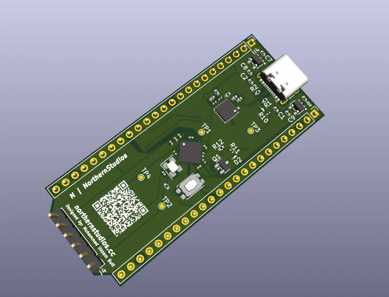

# NorthernStudios FPGA Dev Board

[](https://kicad.org/)
[](https://www.oshwa.org/)
[](https://opensource.org/licenses/MIT)

**Designed by Muhammad Uzzam Butt // Made for Macondo**

---

## 🎨 Overview

An open-source FPGA development board designed in KiCad v9.0, built around the Gowin GW1NSR-4C microcontroller-FPGA hybrid. The board integrates power management, USB-to-UART bridging, clocking, and expanded I/Os, making it a compact and capable platform for embedded hardware and FPGA development.



---

## 🔧 Hardware Features & Specifications

### 1. **Core Processing Unit**
- **FPGA Chip**: **Gowin GW1NSR-4C (GW1NSR-4C_MG64P)**
  - Embedded **ARM Cortex-M3** Hard IP Core
  - 4,608 Look-Up Tables (LUTs)
  - 3,456 Flip-Flops (FFs)
  - Embedded Block RAM (sRAM) and Flash memory
  - High-performance, low-power MBGA64 package

### 2. **Power Architecture**
- **Primary Input**: USB Type-C (+5V VBUS)
- **Regulators**:
  - **AP2112K-3.3** (LDO, 600mA): Delivers stable **+3.3V** to the FPGA I/O banks, clock oscillator, and USB-to-UART bridge.
  - **AP2112K-1.2** (LDO, 600mA): Delivers **+1.2V** core voltage to the Gowin FPGA.
- **Filtering/Decoupling**: Dedicated bypass capacitors (0.1uF and 10uF) on all power rails to minimize noise.

### 3. **Connectivity & Interface**
- **USB Interface**: USB 2.0 Type-C connector.
- **USB-to-UART Bridge**: **CP2102N-Axx-xQFN24** for high-speed serial communication, programming, and debugging.
- **Expansion I/O**: Dual 24-pin headers (`Conn_01x24_Pin`) breakout for FPGA pins, GPIOs, power rails, and ground, enabling easy breadboarding and peripheral expansion.
- **PMOD / Interface Header**: 6-pin connector (`Conn_01x06_Pin`) for SPI, I2C, or UART hardware attachments.

### 4. **Clocking & Peripherals**
- **Oscillator**: **SG-8002CE (24.0000MHz)** active crystal oscillator.
- **User Interface**: 
  - Reset and user-definable push buttons (`SW_Push`).
  - Diagnostic and status LEDs.
- **Level Shifter / Switches**: N-channel MOSFETs (**BSS138**) for level translation or switching purposes.

---

## 📁 Repository Structure

```
├── Images/                 # Documentation media and schematic/PCB renders
│   └── image.webp          # Board/PCB top-view render thumbnail
├── datasheets/             # Component datasheets
├── docs/                   # PDFs of schematics, layout diagrams, and user guide
└── hardware/               # KiCad 9.0 project files
    ├── libraries/          # Custom libraries
    │   ├── 3d_models/      # Custom 3D step models
    │   ├── footprints/     # Footprints (.pretty)
    │   └── symbols/        # Schematic symbols
    ├── NS FPGA.kicad_pro   # KiCad Project File
    ├── NS FPGA.kicad_sch   # KiCad Schematic
    └── NS FPGA.kicad_pcb   # KiCad PCB Layout
```

---

## 🛠️ Design & Manufacturing Guidelines

### **KiCad Setup**
1. Ensure you are running **KiCad v9.0** (or later) to open the `.kicad_pro` project.
2. Link the custom symbol library [gowin_fpga.lib](file:///D:/NS%20FPGA/gowin_fpga.lib) or search/place custom parts under `hardware/libraries/`.

### **Manufacturing Files**
To order this PCB from fabrication houses (e.g., JLCPCB, PCBWay):
1. **DRC**: Run the Design Rule Checker in KiCad's PCB Editor to verify trace width, clearances, and annular rings.
2. **Gerbers**: Export Gerber files (including copper layers, solder mask, silkscreen, edge cuts) and Excellon Drill files.
3. **BOM/CPL**: Generate the Bill of Materials and Centroid/Pick-and-Place coordinates if opting for SMD assembly.

---

## ⚖️ License

This project is open-source hardware licensed under the **[MIT License](LICENSE)**. 

---

*Designed by Muhammad Uzzam Butt // Made for Macondo*
