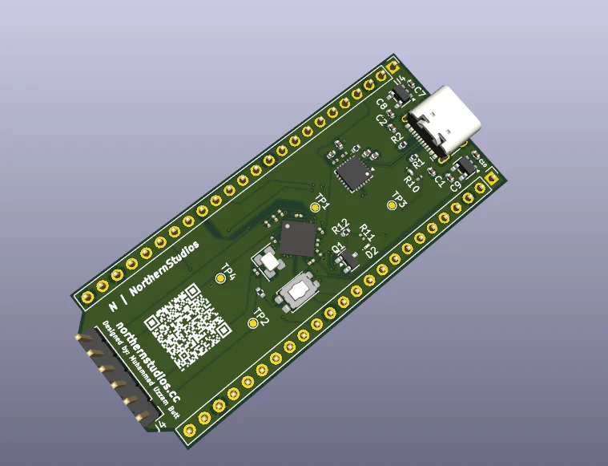

# NorthernStudios FPGA Dev Board

**Designed by Muhammad Uzzam Butt // Made for Macondo**

---

## Overview
This FPGA Devboard is designed in KiCad v9.0 and is built around the Gowin GW1NSR-4C, a hybrid FPGA chip containing an embedded ARM Cortex-M3 microcontroller. 

---

## Hardware Specifications

### FPGA Core
* FPGA Chip: Gowin GW1NSR-4C (specifically GW1NSR-4C_MG64P in an MBGA64 package)
* Embedded ARM Cortex-M3 hard core processor
* 4,608 Look Up Tables (LUTs)
* 3,456 Flip Flops (FFs)
* Embedded block SRAM and internal Flash memory

### Power Delivery
* Input Source: USB Type-C (+5V VBUS)
* Core Regulator: AP2112K 1.2 LDO (600mA) generating +1.2V for the FPGA core
* I/O and Peripheral Regulator: AP2112K-3.3 LDO (600mA) generating +3.3V for I/O banks, clocking, and UART bridge
* Decoupling: Optimized bypass capacitor networks (0.1uF and 10uF) on each power pin to ensure low-noise rails

### Interfaces and Connectivity
* USB Connector: USB 2.0 Type-C interface
* Serial Communication: CP2102N USB-to-UART bridge for programming and debug output
* Main Breakout: Dual 24-pin headers for breadboard compatibility, exposing FPGA I/Os, system power, and ground pins
* Accessory Port: 6-pin PMOD style header for SPI, I2C, or UART hardware attachments

### Clocking and User Controls
* Clock Oscillator: SG-8002CE (24.0000 MHz) active crystal oscillator
* User Controls: Push buttons for system reset and user input
* Visual Indicators: Status and user-configurable LEDs
* Level Translation: BSS138 N-channel MOSFET circuit for voltage-level switching

---
## KiCad Setup

1. Open the project using KiCad v9.0 or later by selecting [NS FPGA.kicad_pro](file:///D:/NS%20FPGA/hardware/NS%20FPGA.kicad_pro).
2. The Gowin FPGA symbol is located in the local library file [gowin_fpga.lib](file:///D:/NS%20FPGA/gowin_fpga.lib). Make sure it is mapped correctly in your KiCad symbol library table if you plan to edit the schematics.

---

## License

This project is open-source hardware licensed under the [MIT License](LICENSE).

---

*Designed by Muhammad Uzzam Butt // Made for Macondo*
